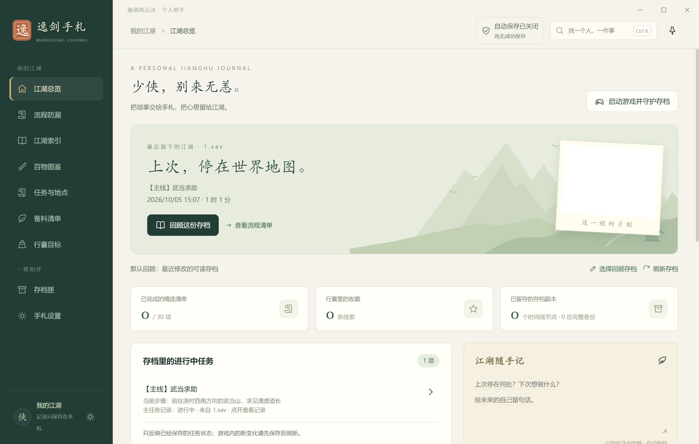

# 逸剑手札

《逸剑风云决》的 Windows 本地辅助工具：静默自动存档、历史读档、任务与地点查询、百物图鉴、赠礼查询和多配方备料。

[下载 Windows 版](https://github.com/Legender134/yijian-journal/releases/latest) · [完整使用说明](使用说明.txt) · [开发与贡献](CONTRIBUTING.md) · [反馈问题](https://github.com/Legender134/yijian-journal/issues)

## 下载与运行

1. 到 [Releases](https://github.com/Legender134/yijian-journal/releases/latest) 下载 Windows x64 的 `YijianJournal-…-windows-x64.zip`，不要下载 GitHub 自动生成的 `Source code`。
2. **完整解压**到可写文件夹，双击 `逸剑手札.exe`。请保留同目录中的其他文件。
3. 手札会寻找 Steam 游戏与存档；没有找到存档时，可在「手札设置」选择 `SaveGames` 目录。游戏安装位置由 Steam 自动检测，多账户时请确认选对存档。
4. 需要静默自动存档时，按下方「游戏接入」完成设置。

当前开发版（1.12.36）的首次使用已简化：自动识别本机存档，默认跟随最新进度、开启完整自动备份和游戏内轻提示；无需设置阶段或目标，就会提示存档中正在进行的任务，优先显示存档里追踪的任务和步骤。首页直接查询、回顾或备料；「开始游戏」可在一次确认后完成组件接入与 10 秒自动存档，无需逐项配置。也可选择「直接开始游戏」，以后不再重复询问，想开启自动存档时再展开首页选项。已有设置会沿用，多账户优先匹配当前登录的 Steam 账户。首次启用时先校验完整保护副本，并独立收藏 29 号槽的原有进度；进阶选项可之后在存档匣和设置中调整。公开下载仍以 Release 的版本为准。

支持 Windows x64。下载包自带运行环境，无需安装 Node.js；应用运行不需要联网，没有账号登录或遥测。打开攻略来源链接时才会交给系统浏览器。

## 能帮你做什么

| 功能               | 用法                                                                                                           |
| ------------------ | -------------------------------------------------------------------------------------------------------------- |
| 静默自动存档       | 最短每 10 秒尝试保存，不打开菜单、不弹保存成功提示；关闭主窗口后留在托盘继续工作。                             |
| 历史时间线         | 查看 10–50 秒、1/2/5/10/30/60 分钟前的有效节点，先预览差异，再确认读档；支持返回读档前进度。                   |
| 图鉴与赠礼         | 离线查看物品、武学、人物和配方；显示图标、头像及品质颜色，并核对存档背包中的礼物。                             |
| 制作与共同物资     | 保存多份计划，从矿石等原料展开加工顺序；任务、赠礼和各计划共用有限库存，预计产物另列。                         |
| 这一程做什么       | 把存档中的任务、缺料与加工、赠礼、带地点的个人待办合到一张行动清单，按地点查阅。                               |
| 任务与地点         | 按存档记录筛选进行中、已完成等任务，继续查看相关人物、场景、前置任务与物品。                                   |
| 周目手札与江湖记录 | 分周目保存待办与计划；逐条记录事件时间、标签和人物地点关联，搜索原文并保留自己的完成、重开记录。               |
| 存档保护与换机     | 一次导出本机手札、完整备份、时间线和以前导入的全部档案；完整备份自动分片与分卷，导入后只读浏览并核对重复档案。 |

备料会同时核对所有有效制作计划的已知费用，显示共同铜钱缺口；原料购买价格不在费用中，缺少费用或存档资料时会明确提示待核对。备料页另选存档后，材料顺序预览与确认使用同一参照，保留周目原来的默认存档选择。



## 记录与保护

「江湖记录」按事件时间保存正文、标签和关联资料，可按人物、地点、日期与类型找回原文。完成或重开目标、待办、赠礼意图时会留下独立的用户操作记录；删除记录会移入「已删除记录」，可逐条恢复，保留后来新增的内容，也不会改变这些对象的当前状态。已删除记录不会自动过期或清空，永久清除需要另行确认；手札备份和保护包也会携带这些记录。旧版整段随手记仍保留。离线档案也能只读检索逐条记录，无需替换当前手札。

记录正文的开头空行和末尾空白在继续草稿、重开编辑与只改标题时按原样保留。地点、待办与赠礼的备注重新编辑时也保留原有空行。写记录时，资料关联显示完整匹配数量，可按页选择；个人目标等安排会显示备忘，也能用备忘查找，已选关联继续显示当前备忘，可准确移除其中一项。目标关联还显示明确选择的地点和场景编号，任务关联显示任务编号，便于区分同名资料。翻页和查找会保留正在写的正文、标签与已选关联。

自己写下的行囊目标可以直接补充、修改或移除地点，带入按地点安排的行程；原目标的说明、完成状态和身份一并保留。未提交的地点选择会随目标草稿暂存。

从物品图鉴加入的收集目标默认收集 1 件，可在目标编辑中填写收集数量。保存后，同一目标的行程、持有量参照和随行小窗按这份数量核对；不会从自由文字猜数量，也不会自动完成目标。

收集目标改成自己的名称后，行动、行程与小窗继续显示这份个人打算，并保留物品名和明确数量；相同物品的不同用途可分别辨认。

主窗和小窗中的随手记在自动保存与周围信息刷新后仍保留当前编辑的撤销、重做；文字首尾的空白与换行按原样保留。另一窗口明确改写正文时会同步已保存的新内容。

全局查询提供全部七种筛选的帮助：输入「品质:」即可查看六种品质，使用方向键选择，Tab 或 Enter 补全。可同时组合种类、类型、品质、名称、地点、状态和标签；直接输入关键词仍然可用。使用「种类:配方 铜锭」等组合时，名称完全匹配的配方会优先出现在图鉴结果中，再显示材料或说明中提及它的配方。同名地点关联显示确切场景编号。

正在编辑的记录会另存本机草稿，查资料、关闭窗口或重启后可继续写。草稿不会变成正式事件；保存时才提交，明确放弃才移除。两个窗口分别保存草稿，同一份编辑发生冲突会保留文字并允许另存，不覆盖另一个窗口的修改。

在记录详情中取消删除会回到原记录，保留阅读位置和键盘焦点；关闭按钮、Esc和点击背景也遵循同一行为。取消时重新显示本周目的当前记录，正式删除仍会核对确认期间的内容变化。

记录详情底部的编辑、旧版本和删除操作会按窗口宽度换行，在主窗和小窗中都可完整查看。

修改手写记录时会保留修改前的完整内容，可从该条记录或「记录旧版本」搜索、查看全文，再明确另存为新记录；当前记录和后来新增的内容继续保留。内容未变化的保存不增加旧版本。旧版本不会自动过期，永久清除须另行确认；达到保留容量时会阻止新的内容修改并保留草稿。JSON 手札、换机保护包和启动恢复会携带旧版本，离线档案可只读查阅。

个人待办、赠礼、地点打算、行囊目标、制作计划名称和本次行程的名称与场景选择也会自动暂存。首页与行程提供「继续未完成的安排」；未提交内容不会占用库存或推进正式行程。原安排被另一窗口修改或删除时，文字会保留，需明确重新核对或另存为新草稿。草稿随手札和保护包保留，历史档案可只读查看。

移除已保存的行囊目标、制作计划、个人待办、赠礼或地点打算前，会显示完整确认内容，并核对另一窗口是否已修改。行囊、备料与行程中的「已移除的个人安排」可按名称与完整内容查找、单条恢复，保留后来新增的内容；同一标识已有新安排时会阻止覆盖。制作计划完整保留配方次数、加工选择、预留与完成状态，找回为独立计划，不改变当前编辑清单。永久清除需要另行确认，已移除内容不会自动过期。目标关联的备料计划若已移除，完整目标仍保留供回顾；还可按原文字另存为独立手动目标，保留原副本。

物品详情的「本周目已有用途」从精确品质反查任务记录预留、手动留用、制作与加工、赠礼安排，并链接回各用途。真实持有、已分配和剩余可安排使用共同预算；预计加工产物与未知库存分别显示，不能作为已经持有或可以出售的结论。修改计划、留用或参照后会重新核对。

赠礼表单可按姓名、物品名称、品质与类别搜索，能选择人物偏好或可分配库存筛选；白、绿、蓝等同名礼物始终显示具体品质，编辑时保留精确条目。个人待办与赠礼的地点可搜索，同名场景仍独立，搜索不会改掉原选择或备注。

完整备份支持按名称、类型、日期、锁定状态筛选，分页和跨页选择。恢复前保护副本默认锁定。「导出所选」保留本机副本；「导出并清理」先生成并完整校验保护包，再确认精确的所选范围。取消清理保留原件，进程中断后可放回尚未删除的副本，或重新选择原保护包核验后继续。含未知对象或损坏字节的副本会保留并报告。

损坏或缺失清单的备份会留在「异常副本目录」区，能定位原件和原因，不能恢复或静默清理。完整导出结果会在重启后保留；结果本身无法写入时会明确提示本次未记录，不把旧成功当作新成功。

手札当前文件与上一份记录都无法读取时，启动进入独立恢复页。可选择 JSON 手札、完整保护包或完整分卷，先校验、预览和确认，再恢复手札；损坏原件保持保留。恢复会保留未完成安排、记录旧版本、已删除记录、已移除安排与物资用途顺序，预览分别列出草稿、旧版本和回收内容的数量。没有可用导出时，也可在二次确认后保留原件、开始空手札。确认时重新校验失败会清除旧预览和勾选，重新选择资料并核对后才能恢复。恢复后先重新确认本机存档目录，旧机器的路径和原生读写权限不会自动沿用。

完整换机包含以前导入的各代离线档案，不会只带走当前机器。完整备份较多时自动分片，超过单卷容量则生成分卷目录；请复制整个目录并使用「导入分卷目录」。原始时间线本身超过单包容量时会保留源数据并明确报错，完整备份仍可分批导出。所有导出都不覆盖已有文件。

已导入的旧档案在本机损坏时，可重新导入完好的原保护包。完整校验成功的旧档案沿用原件；未通过校验的旧档案原样保留，并从原保护包另存可用的只读档案。界面会说明保留数量，再次导入会沿用已经验证的可用副本。当前手札、游戏存档和损坏证据均不被覆盖。

## 规划这一程

首页或备料页点击「用现有材料找配方」，先扣除本周目已经留用的物资，再查看已学配方中支持一份或只差少量的选择。候选卡直接显示实际产物、品质和按制作次数计算的数量范围，点击成品可查看对应物品；随机品质逐项列出可能结果，学习图纸单独展示。可选次数加入当前清单或指定保存计划，随后重新核对全部用途。库存、学习记录、基础费与资料等级分别显示；当前生活技能等级仍需在游戏内确认。每张候选卡独立使用同一份余料，不表示全部候选可以同时制作。

材料争用时可预览并调整用途顺序，确认前查看每项实际物品的分配变化。留用与任务预留继续保留；直接材料按确认的顺序分配，加工使用剩余真实库存。确认后打开另一份计划不会暗中改变该顺序。

将想办的行动加入「本次行程」，命名并排序后开始。同名地点有多个资料场景时，可先按「场景待核定」保留行动，之后再补选具体场景；首页、小窗、行程回顾与重启都会保留这一提示，不要求猜编号。选好行程后，首页会优先显示同一份行程的下一项与剩余数量，重新打开即可续接；首页、主行程与小窗共享下一项，可个人处理、仅本次跳过或分别撤回；游戏进度始终按当前已保存参照核对。同一任务进入唯一已知后续且场景仍相符时，会保留原选择并接续当前步骤；多个进行中步骤或场景变化时，可明确选择接着办哪一步。已失败、尚未接取或父子任务记录矛盾时，保留原选择并提示在游戏中核对，暂停接续。行动来源消失时会保留选择并提示复核。结束后可将回顾存为江湖记录，重启与换机保护包会保留行程及物资顺序。

随手记清空前会立即保留原文字，可从首页或江湖记录中的「找回旧内容」预览并放回；恢复前会保留当前非空文字，并拒绝已经变化的旧预览。取消恢复预览会返回原先展开的旧内容，保留阅读位置与键盘焦点。最近 20 份非空旧内容随周目保存；连续编辑每隔 5 分钟保留一份，清空和恢复前立即保留。重启、手札备份、换机保护包及启动恢复会保留这些文字；更早的内容可另行导出备份。

完整保护资料导出遇到同名目标时，会保留原文件并提示另选新文件名；具体技术诊断收在可展开的详情中。

在完整备份预览中取消改名，会重新校验并返回同一副本，保留原阅读位置与键盘焦点；不会保存尚未确认的新名称。如果副本已损坏，会提示校验失败，不把旧预览当作已验证结果。

收集目标的行动卡直接显示参照存档中已保存的持有量与时间；未知库存会明确标注，收藏目标本身不会预留材料或自动完成。键盘切换主窗和随行小窗页面后，焦点会保留在导航按钮，当前页面有可识别的标记。

存档只记录某个任务步骤、没有上级任务记录时，首页入口仍可打开该步骤的真实文字和状态；详情会说明上级记录缺失，计数与当前列表保持一致。

从本次行程移除行动或清空行程时，会保留原来的整份行程，可在「已移除的个人安排」找回名称、行动顺序、场景选择和本次跳过状态。找回前可完整比较原行程与当前行程；替换的当前行程也会保留，后来添加的待办、赠礼、目标和个人处理记录继续沿用。恢复行程不回退游戏进度。离线档案可直接展开保存的行程只读回顾，无需先使用整份历史手札。

整份保存的制作计划都做完后，可在备料页或行程小窗点击「完成整份制作计划」，核对配方次数后确认。只释放这份计划的用料，配方和原预留偏好仍保留；重新打开可继续核对。普通的「个人已处理」保留用料，独立勾选的目标也不会被改写。配方步骤分别显示学习物与实际产物、品质和可能结果；预计产物不会算入背包。制作行动显示实际产物及品质，展开可核对原配方与次数；随机结果逐项列候选，不计为当前背包。关闭自动备份后，行程与余料配方页仍会随新保存的存档自动更新。

小窗追踪已完成的制作计划时，会显示具体计划名称、已完成状态和「若重新制作」说明。该计划的核对清单只供再次制作时参考；其他尚未完成安排的实际缺料会另外说明。

「这一程做什么」把已保存的任务进度、制作和加工步骤、赠礼意图与带地点的个人待办放在一起，按有出处的地点线索分组。已备齐的材料保留记录，默认待处理视图只展示仍需行动的项目；人物当前位置、剧情解锁和商店现货仍须在游戏内核对。

制作计划可分别命名、保存、打开和修改。任务预留、手动留用、赠礼和多份制作计划共用真实库存；加工还会占用剩余原料。直接材料、展开后的原料缺口、需要完成的加工次数分开显示，计划产物不会提前变成背包库存。打开保存计划或移出配方前，会保留上一份编辑清单、原次数、加工选择与保留设置，可在备料页找回。找回时也保留后来编辑的清单，可以再次切回；重启后仍可使用。

任务目标默认按本周目所选存档显示进度；换成旧档可以重新出现未完成状态。自动推断不写成永久勾选，个人完成和「已处理」记录可独立撤回。也可把任务目标改成手动追踪。

全局查询覆盖资料、个人目标、制作计划和笔记，支持中文条件、引号、排除和括号组合，例如 `种类:物品 品质:绿 永久增加气血`、`(品质:绿 or 品质:蓝) 种类:物品`。常用和最近查询按周目保存。查询解析借鉴并适配 [Destiny Item Manager 的 MIT 开源实现](https://github.com/DestinyItemManager/DIM)，许可随包保留；制作安排参考 Teamcraft 对真实用料、加工产物与制作次数的区分。

换机使用单个 `.yijian-protection` 保护包，包含全部周目的手札、已校验完整备份、时间线原始字节与书签备注。导入后在独立档案只读浏览，旧路径、账户和原生权限不自动绑定；使用历史手札前保留当前副本，完整恢复仍须退出游戏并确认，先校验当前进度的保护副本。历史备份恢复成功后，在存档匣「最近操作结果」保留备份名称、恢复目标和安全副本编号，重启后可核对；取消不会记为成功。历史目标也显示已保存的地点和场景编号，无需先使用历史手札即可核对。历史档案可再次完整导出。

## 游戏接入：自动存档与历史读档

原生接入限定 **《逸剑风云决》v1.24.32 / Steam Build 21798996**，启用前还检查游戏可执行文件的 SHA-256；版本或文件不匹配时会拒绝启用接入。图鉴与攻略参考同一版本，更新后的数值和触发条件可能不同。

1. **退出游戏**，进入「存档匣」，展开「游戏接入组件」。
2. 在应用中确认安装随包提供的官方 UE4SS 组件，然后重新启动游戏、载入自己的存档。
3. 确认手札显示「游戏已连接」，开启「时间线自动存档」，建议使用默认 10 秒间隔。

组件新增文件，不替换游戏程序或资源包；遇到其他已安装组件会拒绝混装。组件版本和文件校验值见 [provenance.json](src/game-bridge/provenance.json)。

本版通讯支持中文用户名、中文存档与手札目录以及路径中的空格，保留原目录。旧接入需退出游戏后明确更新，并重新确认启用时间线；旧权限不会自动继承。新增通讯模块已通过 Windows 原生文件接口、合成游戏接口及隔离流程验证，本轮没有启动实际游戏，不能把合成验证视作新版组件的真实游戏运行记录。

运行中会定期核对 Steam 的游戏位置和版本，首页与随行小窗会跟随更新。等待游戏连接时，完整自动备份仍会保护已保存的文件；原生连接工作时暂停完整复制，避免重复备份。发现游戏版本或组件不兼容时，会停止原生自动存档并恢复完整文件备份，保留既有时间线节点和槽位归属。

Steam 移动安装目录或接入脚本过期时，会明确提示退出游戏后更新组件。游戏更新后，如果仍有已识别的接入加载文件，需先在存档匣停用接入才能从手札启动；不会自动修改游戏目录。存读档正在进行或上次操作待核对时，也会暂缓启动游戏。

- 时间线独占 **29 号手动槽位**，请勿在游戏中手动覆盖它。发现已有其他进度或外部修改时会停止覆盖。
- 战斗、菜单、对话、过场和切换场景期间暂停；这是游戏原生存档，只能回到有效保存点。
- 11 个时间按钮显示实际时间和偏差；没有足够接近的存档时按钮不可用。最多轮换 47 份自动候选，并非保存每次操作。收藏及最近一次读档前保护另存。
- 历史读档需要先确认，程序会先保存当前进度并建立校验通过的完整保护副本，再加载目标。
- 「自动备份」只复制已经写入的存档；「时间线自动存档」才会主动让游戏保存。两者在界面中分别设置。
- 停用或卸载接入组件请退出游戏，并使用手札中的停用入口。Steam 云同步设置由玩家自行管理；恢复前应等待云同步结束。

## 快捷键与数据位置

`Ctrl+K` 搜索；`Ctrl+Alt+J` 打开随行小窗；`Ctrl+Alt+S` 静默保存并收藏；`Ctrl+Alt+H` 打开历史存档。存读档快捷键可在设置中修改或停用。

个人数据保存在 `%APPDATA%\YijianJournal`，与解压目录分离。更新时退出旧程序，再完整解压新版；笔记、设置、收藏和备份会沿用。关闭窗口仅最小化到托盘，真正退出请使用托盘菜单或设置中的「退出手札」。

开发版首次使用的游戏通讯状态也放在用户数据目录，不要求打开软件时就能写入游戏安装目录。已有接入组件沿用原通讯目录和密钥；安装原生组件仍需在确认后写入游戏目录。

存档中的任务、背包等是**已保存时的记录**；未出现在记录中的任务不等于失败或错过。人物名、图鉴与地点名可能透露后续内容，少剧透模式只折叠详细说明。

## 从源码运行

完整模块说明、隔离开发方式、资料生成与 PR 流程见 [开发与贡献指南](CONTRIBUTING.md)。普通功能开发不需要游戏本体，仓库已包含必要资料和合成存档测试。

开发环境：Windows x64、Node.js 24、pnpm 11。所有运行时逻辑使用 Electron 和 Node 内置模块，npm 依赖仅用于开发和打包。

```powershell
git clone https://github.com/Legender134/yijian-journal.git
cd yijian-journal
pnpm install --frozen-lockfile --ignore-scripts
pnpm electron:install
pnpm start
```

使用 `--ignore-scripts` 后显式安装 Electron，避免依赖管理器的构建脚本审批差异。Electron 安装需要访问其官方下载服务。

```powershell
pnpm test             # 核心单元测试，使用临时合成存档
pnpm smoke            # 隔离 Electron 界面与持久化检查
pnpm package          # 生成当前版本的 dist/v1.12.36/逸剑手札-win32-x64
pnpm test:package     # 对当前打包产物进行隔离界面与 IPC 回归
pnpm release:zip      # 生成下载 ZIP 与 SHA256SUMS.txt
```

自动化测试不启动或接入真实游戏，不访问玩家个人存档。`YIJIAN_TEST_DATA` 是应用的隔离测试入口；界面测试使用本地 `playwright` 开发依赖，无需安装浏览器。`PLAYWRIGHT_MODULE` 可覆盖其模块位置。

## 来源与许可

这是非官方玩家工具，与游戏开发商和发行商无隶属关系。原创应用代码采用 [MIT 许可](LICENSE)。游戏名称、图片、文本及资料索引保留原权利人的权利，**不纳入本项目 MIT 授权**；使用和再分发这些内容须遵守其适用权利。UE4SS 和 Electron 的许可及来源见 [第三方说明](THIRD_PARTY_NOTICES.md)。游戏资料不是游戏本体，也不包含玩家存档。

精选社区线索独立整理，注明来源、作者和参考版本，属于选择性参考；本项目不承诺完整攻略覆盖、全收集判定或所有版本兼容。报告问题时请提供手札版本、游戏版本、复现步骤和错误文字，分享截图或日志前先隐去账户信息和存档路径。

## 当前源码新增的游戏内随行辅助（1.11.0）

游戏在前台时，显示最多两条穿透鼠标、不获取焦点的提示；离开游戏后隐藏。Ctrl+Alt+J 展开追踪、查询、备料和历史面板，Esc 先关闭详情再收起。备料尊重周目参照和预留库存，标明存档时间，每五秒核对有效存档；不能读取尚未保存的实时背包。四角位置、透明度和轻提示开关可在设置中调整。独占全屏叠加的可见性取决于环境，窗口化及无边框模式可使用置顶窗口。已连接原生组件时，不可保存场景及存读档过程中暂停轻提示。

窗口组件只读取进程路径、前台窗口和客户区尺寸，按同一已核验目标恢复焦点；不会读游戏内存、模拟游戏操作或写存档。开发启动和打包会通过 Windows 自带 .NET Framework C# 编译器生成该组件，源码见 `src/native/GameWindow.cs`。打包将 `YijianWindow.exe` 放入 resources，并在发行清单中校验 SHA-256。`pnpm build:window` 可单独编译；`node scripts/window-helper-smoke.cjs` 使用合成且不激活的窗口验证进程身份和退出，自动测试不会启动游戏。当前 GitHub 已发布下载版本仍以上方下载链接为准。

完整副本校验失败后会保留失效提示和操作记录；最近保护副本失效时，重新生成并校验成功前不会宣告保护就绪。损坏副本继续保留。少剧透设置也适用于任务待办，任务用料可主动预留，赠礼和备料沿用相同预留。无法读取进度的存档仍可完整备份，并显示重新保存或核对版本的指引。

开发版 1.12.4：历史档案有异常时，完整导出会列明无法校验的档案并停下，取消保留全部原件。明确确认后，可导出当前资料和其余已校验历史；异常原件仍留在本机，本次导出不包含它们，换机前请另外保留原始数据目录。确认后再次校验，源数据或范围变化会要求重新发起导出。退出也会先确认各窗口的编辑已保存；保存失败保持运行并提示处理草稿。
